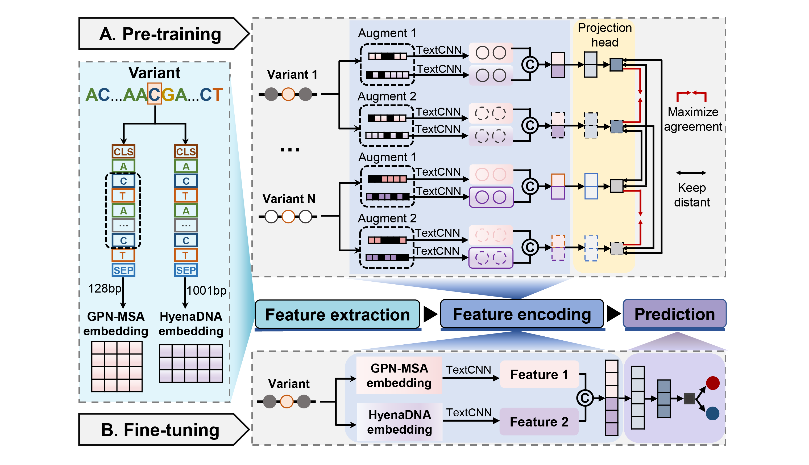

# Prediction of human pathogenic start loss variants based on multi-channel features

StartCLR is a novel prediction method that combines self-supervised contrastive learning pre-training with supervised fine-tuning specifically for identifying pathogenic start loss variants. It effectively utilizes information from a large amount of unlabeled data and a small amount of labeled data, integrates embedding features from different DNA language models to comprehensively characterize the variant context sequence, and thus achieves accurate prediction of pathogenic variants.


## Basic requirements
To install dependencies, create a new conda environment:
```bash
conda env create -f StartCLR.yml
```
We run the program on the Ubuntu 22.04.4 LTS system.

## Additional requirements for model construction

### GPN-MSA
This module is used to quantify the Ref-seq feature about reference sequence.

To install dependencies, create a new conda environment:
```bash
pip install git+https://github.com/songlab-cal/gpn.git
conda env create -f GPN-MSA.yml
```
To download the pre-trained model：
```bash
cd GPNMSA
wget https://huggingface.co/datasets/songlab/multiz100way/resolve/main/89.zarr.zip
cd model
wget https://huggingface.co/songlab/gpn-msa-sapiens/resolve/main/pytorch_model.bin?download=true
```
For more information about GPN-MSA, see https://doi.org/10.1101/2023.10.10.561776 and https://github.com/songlab-cal/gpn.

### HyenaDNA 
This module is used to quantify the epigenetic feature about mutated sequence.

To install dependencies, create a new conda environment:
```bash
conda env create -f HyenaDNA.yml
```
For more information about HyenaDNA, see https://doi.org/10.1093/nar/gkw226 and http://github.com/uci-cbcl/DanQ.

## Quick start

### Input format
StartPred supports variants in CSV format as input. The input file should contain at least 7 columns in the header as follows. [Sample file](./data/test.csv)

|  Chr  | Pos |  Ref  |  Alt  |  Label  |  Reference sequence  |  Mutated sequence  |  ...  |
| ----- | --- | ----- | ----- | ------- | -------------------- | ------------------ | ----- |

Please note that the length of both the reference and mutated sequences are 1001 base pairs(bp), with the mutation site at the center, and the context sequences on each side are 500 bp.

### Quantify the Ref-seq feature based on GPN-MSA
```bash
conda activate GPN-MSA
cd GPNMSA
python GPN-MSA_feature_prepare.py
```
In this section, the example output file titled 'test_GPN-MSA_feature.pth' is available for download at https://zenodo.org/records/13689721.

### Quantify the epigenetic feature based on DanQ
```bash
conda activate HyenaDNA
cd HyenaDNA
python HyenaDNA_feature_prepare.py
```

In this section, the example output file titled 'test_HyenaDNA_features.pth' is available for download at https://zenodo.org/records/13689721.

### Pathogenicity prediction

#### Encoder pre-training
```bash
conda activate StartCLR
cd StartCLR
python main_pretrain_aug.pypython main_pretrain_aug.py  --epochs 20  --batch_size 256  --lr 0.0001  --dropout 0.1
```
#### Encoder fine-tuning and classifier training
```bash
python main_finetune_aug.py   --epochs 20   --learning_rate 0.5  --dropout 0.1  --pretrained ./pretrain/simCLR_checkpoint_0019.pth.tar
```

### Output format
The program directly displays the prediction results upon completion.

It provides a comprehensive overview of StartCLR's predictive performance on the dataset, encompassing various metrics such as recall, specificity (SPE), precision (PRE), F1-score (F1), Matthew's correlation coefficient (MCC), accuracy (ACC), the area under the receiver operating characteristic curve (AUC), and the area under the precision-recall curve (AUPR).
The scoring threshold for StartCLR is established at 0.5, whereby variants scoring below 0.5 are designated as benign and those scoring above 0.5 are identified as pathogenic.

## Cite us
```
@misc{
      title={Prediction of human pathogenic start loss variants based on self-supervised contrastive learning}, 
      author={Jie Liu and Chen Wei and Henghui Fan and Lihua Wang and Bin Ye and Junfeng Xia},
      year={2025}
}
```
